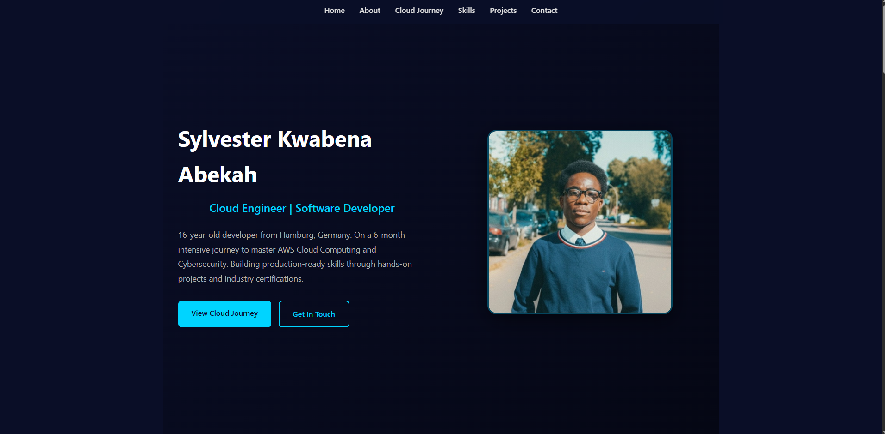
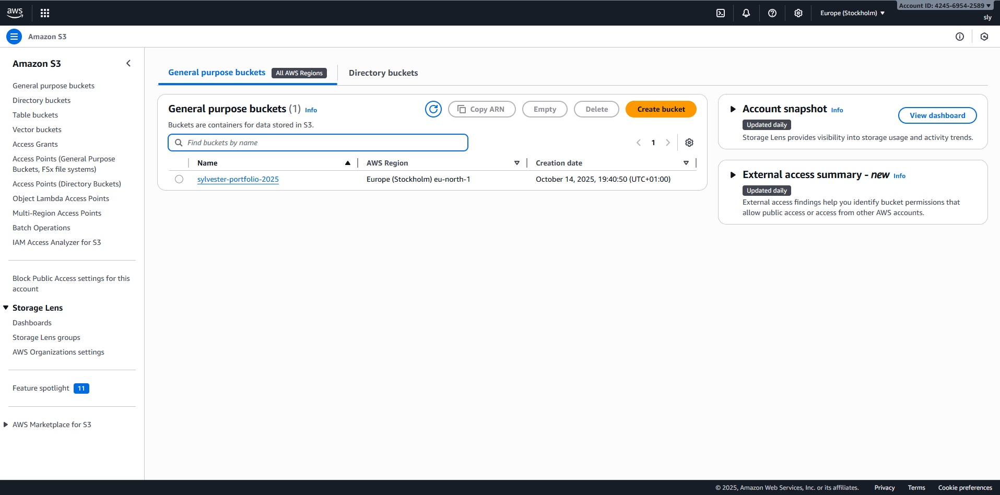
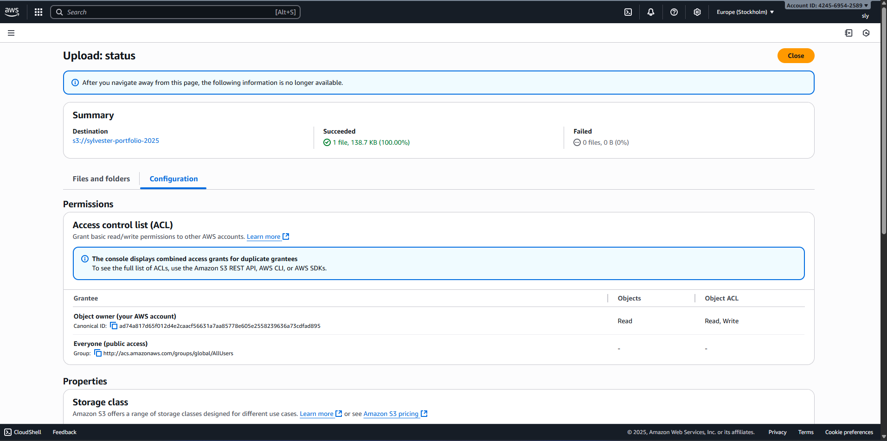

# Project 1: Static Website on AWS S3

**Status:** ✅ Complete  
**Date:** October 15, 2025  
**Week:** 1  

---

## 🌐 Live Demo

**URL:** http://sylvester-portfolio-2025.s3-website.eu-north-1.amazonaws.com

---

## 📋 Project Overview

Professional portfolio website hosted on Amazon S3 using static website hosting. This project demonstrates understanding of S3 storage, bucket policies, and cloud-based web hosting.

---

## 🎯 Objectives

- Learn S3 bucket creation and configuration
- Understand static website hosting
- Configure bucket policies for public access
- Deploy a production-ready website
- Stay within AWS free tier

---

## 🛠️ Technologies Used

- **AWS S3** - Object storage and static hosting
- **HTML/CSS** - Frontend
- **AWS IAM** - Bucket policies
- **AWS Region** - eu-north-1 (Stockholm)

---

## 📸 Screenshots

## 📸 Screenshots

### Live Website


### AWS S3 Configuration


### Static Hosting Setup

```

```
projects/
├── README.md
└── 01-static-website-s3/
    ├── README.md
    ├── website-live.png
    ├── s3-bucket.png
    └── s3-config.png

---

## 🚀 Implementation Steps

### 1. Created S3 Bucket
- Bucket name: `sylvester-portfolio-2025`
- Region: Europe (Stockholm) - eu-north-1
- Disabled "Block all public access"

### 2. Uploaded Files
- `index.html` - Main website file
- `hero.jpg` - Profile photo

### 3. Configured Static Website Hosting
- Enabled static website hosting
- Set index document to `index.html`

### 4. Added Bucket Policy
```json
{
    "Version": "2012-10-17",
    "Statement": [
        {
            "Sid": "PublicReadGetObject",
            "Effect": "Allow",
            "Principal": "*",
            "Action": "s3:GetObject",
            "Resource": "arn:aws:s3:::sylvester-portfolio-2025/*"
        }
    ]
}
```

### 5. Tested and Verified
- Website accessible via S3 endpoint
- All navigation working
- Images loading correctly
- Responsive on mobile

---

## 💡 What I Learned

### Technical Skills
- S3 bucket creation and configuration
- Static website hosting setup
- Bucket policy JSON syntax
- Public access configuration
- AWS console navigation

### Key Concepts
- Object storage vs traditional hosting
- AWS IAM policies
- S3 URL structure
- Free tier limitations
- Regional endpoints

### Challenges Solved
- **404 Error:** Initially uploaded files with wrong name (`portfolio.html` instead of `index.html`)
- **Solution:** Renamed file to match the index document configuration
- **Learning:** Importance of following AWS naming conventions

---

## 💰 Cost Analysis

**Total Cost:** $0.00

**Free Tier Coverage:**
- S3 Storage: 5GB free (used < 1MB)
- GET Requests: 20,000 free/month
- PUT Requests: 2,000 free/month
- Data Transfer: 100GB free/month

**Monitoring:**
- Set up billing alerts
- Staying well within free tier limits

---

## 🎓 Skills Demonstrated

- [x] AWS S3 configuration
- [x] Static website hosting
- [x] Bucket policy management
- [x] Public access configuration
- [x] Cloud deployment
- [x] Cost optimization (free tier)
- [x] Documentation

---

## 🔄 Future Improvements

- [ ] Add custom domain name
- [ ] Enable CloudFront CDN for faster loading
- [ ] Add SSL certificate (HTTPS)
- [ ] Implement versioning
- [ ] Add CloudWatch monitoring
- [ ] Set up automated deployments

---

## 📚 Resources Used

- [AWS S3 Documentation](https://docs.aws.amazon.com/s3/)
- [Static Website Hosting Guide](https://docs.aws.amazon.com/AmazonS3/latest/userguide/WebsiteHosting.html)
- AWS Skill Builder - Module 3: Storage & Databases

---

## ✅ Project Checklist

- [x] S3 bucket created
- [x] Static hosting enabled
- [x] Files uploaded
- [x] Bucket policy configured
- [x] Website accessible publicly
- [x] Responsive design working
- [x] Documentation complete
- [x] GitHub updated
- [ ] Screenshots added
- [ ] LinkedIn post published

---

**Project Status:** ✅ Successfully Deployed  
**Next Project:** WordPress on EC2 (Week 4)
